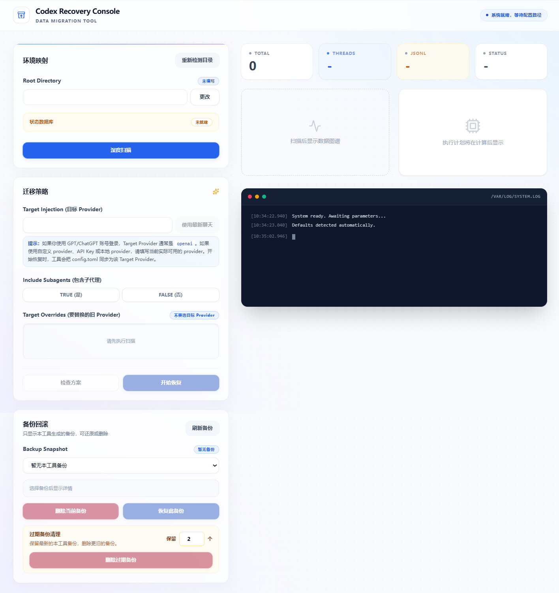

# Codex History Recovery

A local recovery tool for restoring missing chat threads in the Codex desktop sidebar.

## Interface Screenshot



## Use Case

If you switch Codex login or authentication methods on the same computer, your old chats may still exist locally, but they may disappear from the Codex desktop sidebar.

This tool is built for that situation. It checks your local Codex history and state database, then helps bring existing user chat threads back into a state that the current Codex desktop app can recognize and display.

After switching authentication modes, switching providers, upgrading Codex, or hitting a local state/index mismatch, you may see this situation:

- Old transcripts still exist under `%USERPROFILE%\.codex\sessions`
- Archived transcripts may still exist under `%USERPROFILE%\.codex\archived_sessions`
- Thread rows still exist in `state_5.sqlite`
- But the Codex desktop sidebar no longer shows the old chats

This tool scans your `.codex` state, builds a restore plan, creates a backup, then synchronizes SQLite rows, JSONL session metadata, `session_index.jsonl`, and workspace root hints.

## Important Warning

This tool modifies local Codex state files. It creates a backup before writing, but you should still close or restart Codex desktop first to reduce the chance of active JSONL files being locked.

By default, the tool migrates only user-owned main chat threads. It does not migrate subagents unless you explicitly choose to include them.

## Features

- Modern React + Tailwind CSS interface
- Local Node.js service for filesystem and state database operations
- Built-in database access through project dependencies
- Provider distribution scan
- Latest user chat provider detection
- Manual target provider selection
- Manual old provider selection
- Optional subagent migration
- Restore plan check before writing
- Automatic pre-restore backup
- Automatic post-restore verification
- Windows double-click launcher

## Requirements

- Windows
- Node.js 20.19 or later
- npm

The required database access module is installed with the project dependencies. Users only need Node.js and npm.

## Quick Start

### Option 1: Double-click launcher

Double-click:

```text
restore-codex-sidebar-chat.cmd
```

On first launch, the script runs:

```text
npm install
npm run build
node server.cjs
```

Then your browser opens the local UI automatically.

Keep the command window open while using the tool. That window is the local recovery service.

### Option 2: Command line

```powershell
cd D:\Codex\history-recovery
npm install
npm run app
```

If the frontend is already built:

```powershell
npm run build
npm start
```

Default local URL:

```text
http://127.0.0.1:47321
```

If the port is already in use, the tool automatically tries the next port.

## Usage Flow

1. Close or restart Codex desktop.
2. Start this tool.
3. Confirm the auto-filled `Codex root`. If it is wrong, click `Change` or `Detect root again`.
4. Confirm that the status database indicator shows `已就绪`.
5. Click the scan button.
6. Review the provider distribution.
7. Select or type the `Target Provider`.
8. You may first create a new Codex chat that appears normally, then return to this tool and click the latest-chat button next to `Target Provider` to fill in that new chat's provider.
9. Choose whether to migrate subagents.
10. Select the old providers that should be replaced.
11. Click `Check plan`.
12. If the plan looks correct, click `Start restore`.
13. After verification passes, restart Codex desktop.

## Core Concepts

### Codex root

The local Codex state directory. The default location is:

```text
%USERPROFILE%\.codex
```

Important files and folders include:

```text
%USERPROFILE%\.codex\state_5.sqlite
%USERPROFILE%\.codex\session_index.jsonl
%USERPROFILE%\.codex\.codex-global-state.json
%USERPROFILE%\.codex\sessions
%USERPROFILE%\.codex\archived_sessions
```

### Provider

A provider is the `model_provider` value stored in Codex thread records. For sidebar recovery, the provider in SQLite and the provider in the first JSONL `session_meta` line must agree.

A common failure pattern looks like this:

- New chats are visible and work normally
- Old chats still exist locally but are hidden from the sidebar
- New chats use provider A
- Old chats still reference provider B
- The sidebar only surfaces user threads for the current provider context

In that case, the old chats need to be synchronized from provider B to provider A.

### Target Provider

The Target Provider is the provider you want restored old chats to use.

The safest way to determine it:

1. Create a new Codex chat that appears correctly in the sidebar.
2. Send a very short test message so the new chat is definitely written to local state.
3. Return to this tool and scan the Codex state.
4. Click the latest-chat button next to `Target Provider`.
5. The tool fills `Target Provider` with the `model_provider` from the latest user chat.

Creating an empty chat may also work, but it is less reliable than sending a message. The latest-chat button reads the latest user chat from `state_5.sqlite`; if Codex has not written the empty chat to the state database yet, or has not written its `model_provider`, the tool may skip that empty chat and read the previous user chat that already has a provider.

If you do not want to send a test message, you can try creating an empty chat first, confirm that it appears in the Codex sidebar, then click the scan button and the latest-chat button. If the button does not fill the expected value, send a short message in the new chat and scan again.

If you are signed in with a GPT/ChatGPT account, the Target Provider is usually `openai`. If you use a custom provider, API key, or local provider, enter the provider that is actually active for your setup. When restore starts, the tool syncs `config.toml` to that Target Provider.

You usually do not need to query it manually. The tool reads `state_5.sqlite` directly and can fill Target Provider from the latest user chat.

If `%USERPROFILE%\.codex\config.toml` still contains an old provider such as `cpa`, do not treat it as the current provider by itself. During restore, the tool syncs `model_provider` in `config.toml` to the Target Provider you confirmed.

Advanced users can still inspect the `threads` table in `state_5.sqlite` with any SQLite viewer. Look at the latest `thread_source='user'` rows. The `model_provider` from a newly visible working chat is the best Target Provider candidate.

### What is Target Provider Injection?

In this project, Target Provider Injection means writing your confirmed Target Provider into the old user threads that need recovery, so SQLite and JSONL metadata become consistent.

The tool synchronizes two locations:

```text
state_5.sqlite threads.model_provider
rollout-*.jsonl first line: session_meta.payload.model_provider
```

This is not code injection. It does not modify message content. It only updates provider metadata so Codex can recognize and display the old user threads under the current provider context.

### Old Provider

The Old Provider is a provider value that old hidden chats still reference.

Example:

```text
Target Provider: codex_local_access
Old Provider: cpa
```

This means the tool will migrate old user threads from `cpa` to `codex_local_access`.

The Old Provider list must not include the Target Provider. In other words, `Target Overrides` should contain the provider values currently attached to old hidden chats, not the target provider you want to write.

If this is selected incorrectly, you may see:

- A warning that Target Overrides cannot include the Target Provider
- A checked plan with 0 threads to restore and 0 JSONL files to update
- Old chats still missing from the sidebar after restore

When that happens, first confirm the `model_provider` from a new chat that appears correctly in the sidebar and use it as the Target Provider. Then select the provider that the old hidden chats originally used.

### What are subagents?

Subagents are auxiliary threads that Codex may create while working on a task. They are usually not the primary chat threads you open from the sidebar. They may represent internal collaboration, analysis, review, or delegated subtasks.

In the database they usually look like:

```text
thread_source='subagent'
```

Normal user-facing main chats usually look like:

```text
thread_source='user'
```

The recommended default is not to migrate subagents because:

- Sidebar recovery mainly depends on user-owned main chats
- Subagents are often not intended to be primary sidebar conversations
- Bulk-migrating subagents may make the recovered index noisy

Only include subagents if you know those subagent threads also need provider synchronization.

## What the Tool May Modify

During restore, the tool may modify:

```text
%USERPROFILE%\.codex\state_5.sqlite
%USERPROFILE%\.codex\sessions\...\rollout-*.jsonl
%USERPROFILE%\.codex\archived_sessions\...\rollout-*.jsonl
%USERPROFILE%\.codex\session_index.jsonl
%USERPROFILE%\.codex\.codex-global-state.json
%USERPROFILE%\.codex\config.toml
```

Before writing, it creates a backup folder:

```text
%USERPROFILE%\.codex\backup-YYYYMMDD-HHMMSS-pre-chat-history-restore
```

The backup includes:

- SQLite state files
- WAL/SHM files
- session index
- global state
- config
- sessions
- archived sessions
- manifest.json

## Backup Rollback

If the result is not what you expected, you can restore one of the automatic backups from the `Backup Rollback` area in the left panel. The backup list only shows backups created by this tool; the tool reads `manifest.json` inside each backup directory and only allows restore or deletion after confirming it was created by this project.

1. Click `Refresh Backups`.
2. Select a backup in `Backup Snapshot`.
3. Click `Restore This Backup`.
4. Confirm the prompt.

Before rolling back, the tool automatically creates another backup of the current state. If you pick the wrong backup, you still have a new safety backup to roll back to.

It is recommended to close or restart Codex desktop before rolling back, so state files are less likely to be locked.

If you no longer need one specific backup, select it in the same area and click `Delete Current Backup`. This only removes the currently selected project backup folder. It does not delete the `.codex` root folder or chat records.

## Backup Cleanup

Backup folders are only used when you need to roll back to the pre-restore state. Codex does not need these backups for normal operation. After confirming that your sidebar chat history has been restored correctly and you no longer need rollback, you can delete old backups from the UI or manually remove them.

Use `Delete Expired Backups` to batch-clean old backups. Set how many recent backups to keep, for example keep the latest 2; the tool previews how many expired backups will be deleted and asks for confirmation before deleting only older project backups.

It is recommended to keep at least the latest 1-2 backups. For manual cleanup, open this folder in File Explorer:

```text
%USERPROFILE%\.codex
```

Only delete folders whose names look like this:

```text
backup-YYYYMMDD-HHMMSS-pre-chat-history-restore
```

Do not delete the entire `.codex` folder.

You can also list existing backups with PowerShell first:

```powershell
Get-ChildItem "$env:USERPROFILE\.codex" -Directory -Filter "backup-*-pre-chat-history-restore" |
  Sort-Object LastWriteTime -Descending |
  Select-Object Name, LastWriteTime, FullName
```

Keep the latest 2 backups and remove older ones:

```powershell
Get-ChildItem "$env:USERPROFILE\.codex" -Directory -Filter "backup-*-pre-chat-history-restore" |
  Sort-Object LastWriteTime -Descending |
  Select-Object -Skip 2 |
  Remove-Item -Recurse
```

To preview what would be deleted first, temporarily change the last line to `Remove-Item -Recurse -WhatIf`.

## Verification Criteria

After restore, the tool prints verification metrics.

Ideal values:

```text
INDEX_BAD=0
null_thread_source=0
USER_THREADS_MISSING_HINT=0
JSONL_USER_MISMATCH=0
JSONL_BAD=0
```

If `JSONL_LOCKED` is greater than 0, Codex is probably holding an active session file open. Close or restart Codex desktop and run the restore again.

## Troubleshooting

### Double-click does nothing

Open a terminal and run:

```powershell
cd D:\Codex\history-recovery
restore-codex-sidebar-chat.cmd
```

If Node.js is missing, install Node.js 20.19 or later and add it to PATH.

### npm install fails

The required database access module is installed with the project dependencies. If dependency installation fails, check:

- Node.js is 20.19 or later
- Your network can reach npm
- Corporate proxy or security software is not blocking native package downloads

If the error comes from the native database dependency, install Node.js 22 LTS and run `npm install` again.

### Browser does not open automatically

Look at the command window. It prints a URL such as:

```text
Codex History Recovery is running at http://127.0.0.1:47321
```

Copy that URL into your browser manually.

### Old chats still do not appear

Check:

- Did you restart Codex desktop after restore?
- Is the Target Provider correct?
- Did you select the correct Old Provider?
- Did you only restore empty provider rows?
- Are any verification metrics non-zero?
- Is `JSONL_LOCKED` greater than 0?

### Not sure which Target Provider to use

Create a new Codex chat that appears in the sidebar, then return to this tool, scan the state, and click the latest-chat button next to `Target Provider`.

If you are signed in with a GPT/ChatGPT account, the Target Provider is usually `openai`. If you use a custom provider, API key, or local provider, enter the provider that is actually active for your setup. When restore starts, the tool syncs `config.toml` to that Target Provider.

## Development

Install dependencies:

```powershell
npm install
```

Run Vite dev server:

```powershell
npm run dev
```

Build frontend:

```powershell
npm run build
```

Start local service:

```powershell
npm start
```

Build and start:

```powershell
npm run app
```

## Project Structure

```text
.
├── src/
│   ├── main.jsx
│   └── styles.css
├── index.html
├── server.cjs
├── package.json
├── package-lock.json
├── tailwind.config.js
├── postcss.config.js
├── vite.config.js
├── restore-codex-sidebar-chat.cmd
└── README.md
```

## License

MIT
