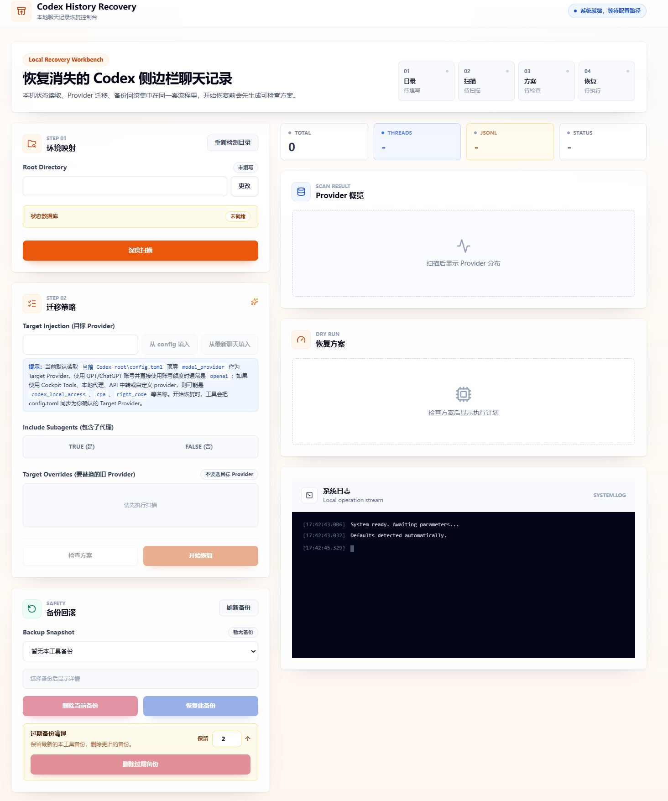

# Codex History Recovery

A local recovery tool for restoring missing chat threads in the Codex desktop sidebar.

## Interface Screenshot



## Use Case

If you switch Codex login or authentication methods on the same computer, your old chats may still exist locally, but they may disappear from the Codex desktop sidebar.

This tool is built for that situation. It checks your local Codex history and state database, then helps bring existing user chat threads back into a state that the current Codex desktop app can recognize and display.

After switching authentication modes, switching providers, upgrading Codex, or hitting a local state/index mismatch, you may see this situation:

- Old transcripts still exist under `%USERPROFILE%\.codex\sessions`
- Archived transcripts may still exist under `%USERPROFILE%\.codex\archived_sessions`
- Thread rows still exist in `state_5.sqlite`
- But the Codex desktop sidebar no longer shows the old chats

This tool scans your `.codex` state, builds a restore plan, creates a backup, then synchronizes SQLite rows, JSONL session metadata, `session_index.jsonl`, and workspace root hints.

It also detects and backs up `auth.json`. Provider metadata controls which sidebar bucket a chat belongs to. `auth.json` controls the current Codex authentication state. Changing chat provider metadata to `openai` does not by itself restore GPT/ChatGPT account sign-in.

## Important Warning

This tool modifies local Codex state files. It creates a backup before writing, but you should still close or restart Codex desktop first to reduce the chance of active JSONL files being locked.

The tool can restore an existing `auth.json` from a previous backup, but it cannot generate, fake, or convert GPT/ChatGPT account credentials. If account sign-in has expired, sign in again through Codex first.

By default, the tool migrates only user-owned main chat threads. It does not migrate subagents unless you explicitly choose to include them.

## Features

- Modern React + Tailwind CSS interface
- Local Node.js service for filesystem and state database operations
- Built-in database access through project dependencies
- Provider distribution scan
- Default Target Provider detection from the top-level `model_provider` in `config.toml`
- Latest user chat provider kept as a verification or fallback reference
- Current `auth.json` authentication-state detection
- Manual target provider selection
- Manual old provider selection
- Optional subagent migration
- Restore plan check before writing
- Automatic pre-restore backup
- Automatic `auth.json` backup
- Manual current `auth.json` snapshot
- Auth-only `auth.json` restore from project backups
- Duplicate manual `auth.json` snapshot cleanup
- Backup-based settings rollback without overwriting chat transcripts
- Automatic post-restore verification
- Can be packaged as a Windows installer and portable desktop app
- Windows double-click launcher

## Requirements

### Desktop Release

- Windows 10/11
- Node.js is not required
- npm is not required
- sqlite3 is not required

If you download the installer or portable build from GitHub Releases, you can run it directly.

### From Source

- Windows
- Node.js 22.5 or later
- npm

This tool uses the SQLite capability built into Node.js / Electron. It does not require sqlite3 or any separate database tool. When running from source, users only need Node.js and npm.

## Quick Start

### Option 1: Download the desktop app (recommended)

Download page: [Download the latest release](https://github.com/HJR523/codex-history-recovery/releases/latest)

Download one of these files from GitHub Releases:

```text
Codex-History-Recovery-Setup-version-x64.exe
Codex-History-Recovery-Portable-version-x64.exe
```

`Setup` is the installer build. Double-click it, follow the installer, then open the app from the desktop shortcut or Start menu.

`Portable` is the portable build. It does not need installation; double-click it to open the app.

The desktop app opens the recovery interface directly. You do not need to install Node.js, open a command window, or visit a local URL manually.

### Option 2: Double-click source launcher

Double-click:

```text
restore-codex-sidebar-chat.cmd
```

On first launch, the script runs:

```text
npm install
npm run build
node --no-warnings server.cjs
```

Then your browser opens the local UI automatically.

Keep the command window open while using the tool. That window is the local recovery service.

### Option 3: Command line

```powershell
cd D:\Codex\history-recovery
npm install
npm run app
```

If the frontend is already built:

```powershell
npm run build
npm start
```

Default local URL:

```text
http://127.0.0.1:47321
```

If the port is already in use, the tool automatically tries the next port.

## Usage Flow

1. Close or restart Codex desktop.
2. Start this tool.
3. Confirm the auto-filled `Codex root`. If it is wrong, click `Change` or `Detect root again`.
4. Confirm that the status database indicator shows `已就绪`.
5. Click the scan button.
6. The tool reads the top-level `model_provider` from `%USERPROFILE%\.codex\config.toml` and fills `Target Provider`.
7. Review `Auth Status`. If you use a GPT/ChatGPT account, the Target Provider is usually `openai`, but the auth status should not be `API Key mode`.
8. Review the provider distribution and confirm that `Target Provider` is correct.
9. If you are unsure, click the latest-chat fill button to compare against the provider from the latest user chat that was actually written locally.
10. Choose whether to migrate subagents.
11. Confirm the old providers that should be replaced. The tool selects providers other than the Target Provider by default.
12. Click `Check plan`.
13. If the plan looks correct, click `Start restore`.
14. After verification passes, restart Codex desktop.

## Core Concepts

### Codex root

The local Codex state directory. The default location is:

```text
%USERPROFILE%\.codex
```

Important files and folders include:

```text
%USERPROFILE%\.codex\state_5.sqlite
%USERPROFILE%\.codex\session_index.jsonl
%USERPROFILE%\.codex\.codex-global-state.json
%USERPROFILE%\.codex\sessions
%USERPROFILE%\.codex\archived_sessions
```

### Provider

A provider is the `model_provider` value stored in Codex thread records. For sidebar recovery, the provider in SQLite and the provider in the first JSONL `session_meta` line must agree.

A common failure pattern looks like this:

- New chats are visible and work normally
- Old chats still exist locally but are hidden from the sidebar
- New chats use provider A
- Old chats still reference provider B
- The sidebar only surfaces user threads for the current provider context

In that case, the old chats need to be synchronized from provider B to provider A.

### Target Provider

The Target Provider is the provider you want restored old chats to use.

For normal Codex desktop users, this tool defaults to the top-level `model_provider` in:

```text
%USERPROFILE%\.codex\config.toml
```

For example:

```toml
model_provider = "codex_local_access"
```

In that case, the tool treats the Target Provider as:

```text
codex_local_access
```

If you are signed in with a GPT/ChatGPT account and directly use that account's quota, the common provider is `openai`.

If you use Cockpit Tools, a local proxy, an API gateway, a custom provider, or another integration, the provider may not be `openai`. It may be the provider name referenced by `model_provider` in `config.toml`, such as `codex_local_access`, `cpa`, or `right_code`.

This provider is the value written into Codex history metadata. It is not the model name and it is not the `base_url`.

The latest-chat fill button is still available, but it is now a verification or fallback feature. It reads the provider from the latest user-owned chat actually written to `state_5.sqlite`; it is no longer the default Target Provider source.

If `config.toml` has no top-level `model_provider`, the tool does not guess `openai` from ChatGPT sign-in state alone. It asks you to fill the Target Provider manually. You may also create a new visible Codex chat, send a short message, then use the latest-chat fill button as a reference.

If you launch Codex with CLI overrides, profiles, a custom `CODEX_HOME`, or a special launcher, confirm the Target Provider against the actual launch environment.

When restore starts, the tool syncs `config.toml` to the Target Provider you confirmed.

### auth.json and account sign-in

`auth.json` is the local file related to the current Codex authentication state. It is separate from the Target Provider:

- Target Provider decides which provider name old chat records should be migrated to
- `auth.json` decides whether Codex currently has a usable authentication state

If you are signed in with a GPT/ChatGPT account and directly use that account's quota, the Target Provider is usually `openai`. However, changing chat records and `config.toml` to `openai` does not necessarily restore account sign-in. If the current `auth.json` is still in API Key mode, Codex may still be unable to send messages through a GPT/ChatGPT account session.

After scanning, the tool shows `Auth Status`:

- `API Key mode`: the current auth looks like API Key auth, not GPT/ChatGPT account sign-in
- `Account sign-in likely exists`: account-login signals were detected, but the final check is whether Codex can actually send messages
- `auth.json not found`: no auth file was found under the selected Codex root

Before writing recovery changes, the tool backs up the current `auth.json`. If you have a previous backup from a time when GPT/ChatGPT account sign-in worked, select that backup in `Backup Rollback` and click `Restore auth.json`. This restores only the auth file and does not migrate chat records.

If the current Codex sign-in state works, it is a good idea to click `Save Current auth.json` and create a dedicated auth snapshot. This snapshot contains only `auth.json` and optional `auth.json.bak`; it does not copy chat transcripts and does not modify provider metadata, SQLite, or `config.toml`.

If repeated saves create duplicates, click `Clean Duplicate Auth Snapshots`. The tool computes a fingerprint from the `auth.json` file content and deletes only older manual auth snapshots with identical content. Full recovery backups are not deleted just because they contain the same `auth.json`.

The tool cannot generate, fake, or convert GPT/ChatGPT account credentials. If there is no usable backup, sign in again through Codex first, then restore chat history.

`auth.json` may contain account credentials or tokens. Do not share auth snapshots, full `.codex` backups, or `auth.json`, and do not upload them to a public repository.

### What is Target Provider Injection?

In this project, Target Provider Injection means writing your confirmed Target Provider into the old user threads that need recovery, so SQLite and JSONL metadata become consistent.

The tool synchronizes two locations:

```text
state_5.sqlite threads.model_provider
rollout-*.jsonl first line: session_meta.payload.model_provider
```

This is not code injection. It does not modify message content. It only updates provider metadata so Codex can recognize and display the old user threads under the current provider context.

### Old Provider

The Old Provider is a provider value that old hidden chats still reference.

Example:

```text
Target Provider: codex_local_access
Old Provider: cpa
```

This means the tool will migrate old user threads from `cpa` to `codex_local_access`.

The Old Provider list must not include the Target Provider. In other words, `Target Overrides` should contain the provider values currently attached to old hidden chats, not the target provider you want to write.

If this is selected incorrectly, you may see:

- A warning that Target Overrides cannot include the Target Provider
- A checked plan with 0 threads to restore and 0 JSONL files to update
- Old chats still missing from the sidebar after restore

When that happens, first confirm whether the top-level `model_provider` in `config.toml` is the provider currently in use. If you recently switched providers, use the latest-chat fill button to compare against the provider most recently written by Codex. Then confirm the provider that the old hidden chats originally used.

### What are subagents?

Subagents are auxiliary threads that Codex may create while working on a task. They are usually not the primary chat threads you open from the sidebar. They may represent internal collaboration, analysis, review, or delegated subtasks.

In the database they usually look like:

```text
thread_source='subagent'
```

Normal user-facing main chats usually look like:

```text
thread_source='user'
```

The recommended default is not to migrate subagents because:

- Sidebar recovery mainly depends on user-owned main chats
- Subagents are often not intended to be primary sidebar conversations
- Bulk-migrating subagents may make the recovered index noisy

Only include subagents if you know those subagent threads also need provider synchronization.

## What the Tool May Modify

During restore, the tool may modify:

```text
%USERPROFILE%\.codex\state_5.sqlite
%USERPROFILE%\.codex\sessions\...\rollout-*.jsonl
%USERPROFILE%\.codex\archived_sessions\...\rollout-*.jsonl
%USERPROFILE%\.codex\session_index.jsonl
%USERPROFILE%\.codex\.codex-global-state.json
%USERPROFILE%\.codex\config.toml
%USERPROFILE%\.codex\auth.json
```

Before writing, it creates a backup folder:

```text
%USERPROFILE%\.codex\backup-YYYYMMDD-HHMMSS-pre-chat-history-restore
```

The backup includes:

- SQLite state files
- WAL/SHM files
- session index
- global state
- config
- auth.json
- sessions
- archived sessions
- manifest.json

## Backup Rollback

If the result is not what you expected, select an automatic backup in the left-panel `Backup Rollback` area, then click `Rollback Restore Settings`. The backup list only shows backups created by this tool; the tool reads `manifest.json` inside each backup directory and only allows rollback or deletion after confirming it was created by this project.

`Rollback Restore Settings` does not move chat history back to the backup timestamp. It reads restore-related state from the selected backup and writes only that state into the current Codex root:

- `threads.model_provider` for current thread rows that also exist in the backup
- `threads.thread_source` for current thread rows that also exist in the backup
- Archived state for current thread rows that also exist in the backup
- The first-line `session_meta.payload.model_provider` in current `rollout-*.jsonl` files
- The top-level `model_provider` in `config.toml`
- A regenerated `session_index.jsonl`
- Missing workspace hints

It does not overwrite:

- Chat transcript lines after the first line in `rollout-*.jsonl`
- Chat content added after the backup was created
- New thread rows that exist now but did not exist in the backup
- `auth.json`

Usage:

1. Click `Refresh Backups`.
2. Select a backup in `Backup Snapshot`.
3. Click `Rollback Restore Settings`.
4. Confirm the prompt.

Before rolling back settings, the tool automatically creates another backup of the current state. If you pick the wrong backup, you still have a new safety backup for another recovery attempt.

It is recommended to close or restart Codex desktop before rolling back, so state files are less likely to be locked.

If you only want to restore authentication state, select a backup that contains `auth.json` and click `Restore auth.json`. This writes only the backup's `auth.json` back to the Codex root. It does not change SQLite, JSONL, or chat records.

If you only want to keep a copy of the current working auth state, click `Save Current auth.json`. It creates a dedicated snapshot named like:

```text
backup-YYYYMMDD-HHMMSS-manual-auth-snapshot
```

This type of snapshot is only for `Restore auth.json`; it cannot be used for `Rollback Restore Settings`.

If you no longer need one specific backup, select it in the same area and click `Delete Current Backup`. This only removes the currently selected project backup folder. It does not delete the `.codex` root folder or chat records.

## Backup Cleanup

Backup folders are only used when you need to roll back to the pre-restore state. Codex does not need these backups for normal operation. After confirming that your sidebar chat history has been restored correctly and you no longer need rollback, you can delete old backups from the UI or manually remove them.

Use `Delete Expired Backups` to batch-clean old backups. Set how many recent backups to keep, for example keep the latest 2; the tool previews how many expired backups will be deleted and asks for confirmation before deleting only older project backups.

Use `Clean Duplicate Auth Snapshots` for a narrower cleanup. It only checks snapshots created by `Save Current auth.json`, keeps the newest copy for each unique `auth.json` content, and deletes older identical copies. It does not delete full recovery backups.

It is recommended to keep at least the latest 1-2 backups. For manual cleanup, open this folder in File Explorer:

```text
%USERPROFILE%\.codex
```

Only delete folders whose names look like this:

```text
backup-YYYYMMDD-HHMMSS-pre-chat-history-restore
```

Do not delete the entire `.codex` folder.

You can also list existing backups with PowerShell first:

```powershell
Get-ChildItem "$env:USERPROFILE\.codex" -Directory -Filter "backup-*-pre-chat-history-restore" |
  Sort-Object LastWriteTime -Descending |
  Select-Object Name, LastWriteTime, FullName
```

Keep the latest 2 backups and remove older ones:

```powershell
Get-ChildItem "$env:USERPROFILE\.codex" -Directory -Filter "backup-*-pre-chat-history-restore" |
  Sort-Object LastWriteTime -Descending |
  Select-Object -Skip 2 |
  Remove-Item -Recurse
```

To preview what would be deleted first, temporarily change the last line to `Remove-Item -Recurse -WhatIf`.

## Verification Criteria

After restore, the tool prints verification metrics.

Ideal values:

```text
INDEX_BAD=0
null_thread_source=0
USER_THREADS_MISSING_HINT=0
JSONL_USER_MISMATCH=0
JSONL_BAD=0
```

If `JSONL_LOCKED` is greater than 0, Codex is probably holding an active session file open. Close or restart Codex desktop and run the restore again.

## Troubleshooting

### Double-click does nothing

Open a terminal and run:

```powershell
cd D:\Codex\history-recovery
restore-codex-sidebar-chat.cmd
```

If Node.js is missing, install Node.js 22.5 or later and add it to PATH.

### npm install fails

If dependency installation fails, check:

- Node.js is 22.5 or later
- Your network can reach npm
- Corporate proxy or security software is not blocking dependency downloads

### Browser does not open automatically

Look at the command window. It prints a URL such as:

```text
Codex History Recovery is running at http://127.0.0.1:47321
```

Copy that URL into your browser manually.

### Old chats still do not appear

Check:

- Did you restart Codex desktop after restore?
- Is the Target Provider correct?
- Did you select the correct Old Provider?
- Did you only restore empty provider rows?
- Are any verification metrics non-zero?
- Is `JSONL_LOCKED` greater than 0?

### Target Provider is openai, but messages still cannot be sent

Check `Auth Status` in the UI first. If it says `API Key mode`, `auth.json not found`, or an unknown auth mode, your chat records may have been migrated to `openai`, but the current Codex state may still not have GPT/ChatGPT account sign-in.

Possible fixes:

- Sign in to your GPT/ChatGPT account in Codex first, then run this tool to restore chats
- If a project backup contains a previously working account sign-in state, select it and click `Restore auth.json`
- If you actually use API Key auth or a custom provider, do not blindly change the Target Provider to `openai`; use the provider that can currently send messages

### Not sure which Target Provider to use

Start with the top-level `model_provider` in `%USERPROFILE%\.codex\config.toml`. The tool reads and fills it automatically after scanning.

If no top-level `model_provider` is detected, or if you recently switched providers, create a new Codex chat, send a short message, confirm that it appears in the sidebar, then use the latest-chat fill button as a comparison point.

## Development

Install dependencies:

```powershell
npm install
```

Run Vite dev server:

```powershell
npm run dev
```

Build frontend:

```powershell
npm run build
```

Start local service:

```powershell
npm start
```

Build and start:

```powershell
npm run app
```

Start the desktop preview:

```powershell
npm run desktop
```

Build the Windows installer and portable app:

```powershell
npm run dist:win
```

Build outputs are generated in the `release` directory. This directory is only for local release builds and should not be committed to the repository.

You can also push a version tag and let GitHub Actions build the Windows artifacts and publish them to GitHub Releases:

```powershell
git tag vX.Y.Z
git push origin vX.Y.Z
```

## Project Structure

```text
.
├── .github/
│   └── workflows/
├── build/
│   ├── icon.ico
│   └── icon.png
├── electron/
│   ├── main.cjs
│   └── preload.cjs
├── src/
│   ├── main.jsx
│   └── styles.css
├── docs/
│   └── images/
├── index.html
├── server.cjs
├── package.json
├── package-lock.json
├── tailwind.config.js
├── postcss.config.js
├── vite.config.js
├── restore-codex-sidebar-chat.cmd
├── README.md
└── README-EN.md
```

## License

MIT
